# Oracle DW — Entity-Relationship Diagram

> **Schema:** AI03 (Kimball star schema, 7 DIM + 5 FACT)
> **Generated from:** [`query/01_schema_dim.sql`](../db_module/db_sources/oracle_sql_query/query/01_schema_dim.sql) + [`query/02_schema_fact.sql`](../db_module/db_sources/oracle_sql_query/query/02_schema_fact.sql)
> **STG tables excluded** — they're transient buffers (truncate-and-load), not part of analytical schema

---

## Table of Contents

1. [Overall ER Diagram](#1-overall-er-diagram)
2. [Star Schema per FACT](#2-star-schema-per-fact)
3. [Tables Reference](#3-tables-reference)
4. [Cardinality Notes](#4-cardinality-notes)
5. [Design Notes](#5-design-notes)

---

## 1. Overall ER Diagram

```mermaid
erDiagram
    DIM_DATE {
        NUMBER date_id PK "smart key YYYYMMDD"
        DATE full_date
        NUMBER year
        NUMBER quarter
        NUMBER month_number
        VARCHAR month_name
        NUMBER week_number
        NUMBER day_of_month
        NUMBER day_of_week "1=Mon..7=Sun ISO"
        VARCHAR day_name
        CHAR is_weekend
        CHAR is_holiday
    }

    DIM_LINE {
        NUMBER line_id PK "SEQ_DIM_LINE"
        NUMBER line_src_id UK "Supabase production_line.line_id"
        VARCHAR line_code
        VARCHAR line_name
        VARCHAR area
        VARCHAR process_type
        CHAR is_active
    }

    DIM_SHIFT {
        NUMBER shift_id PK "1=DAY 2=NIGHT"
        VARCHAR shift_code UK
        VARCHAR shift_name
        NUMBER start_hour
        NUMBER start_minute
        NUMBER end_hour
        NUMBER end_minute
        CHAR crosses_midnight
    }

    DIM_BATTERY_MODEL {
        NUMBER model_id PK "SEQ_DIM_BATTERY_MODEL"
        NUMBER model_src_id UK
        VARCHAR model_code
        VARCHAR model_name
        NUMBER spec_plate_count
        NUMBER spec_weight_kg
        VARCHAR spec_terminal_type
        NUMBER dim_length_mm
        NUMBER dim_width_mm
        NUMBER dim_height_mm
        VARCHAR capacity_class
        VARCHAR chemistry
        CHAR is_active
    }

    DIM_MACHINE {
        NUMBER machine_id PK "SEQ_DIM_MACHINE"
        NUMBER machine_src_id UK
        VARCHAR machine_code UK "M01 M02 M03"
        VARCHAR machine_type
        NUMBER sequence_position
        NUMBER line_id FK "to DIM_LINE"
        VARCHAR line_name "denormalized"
        DATE install_date
        CHAR is_active
    }

    DIM_METRIC {
        NUMBER metric_id PK "manual id 1-6"
        VARCHAR metric_name UK "match Influx field"
        VARCHAR unit
        VARCHAR machine_code "NULL = all machines"
        NUMBER normal_min
        NUMBER normal_max
        NUMBER critical_threshold
        VARCHAR description
    }

    DIM_DEFECT_TYPE {
        NUMBER defect_id PK "SEQ_DIM_DEFECT_TYPE"
        VARCHAR defect_code UK
        NUMBER parent_defect_id FK "self-ref recursive"
        VARCHAR parent_code "denormalized"
        NUMBER hierarchy_level "1=root 2=leaf"
        CHAR is_leaf
        VARCHAR description
        NUMBER severity "1-5"
        VARCHAR category "ROOT or LEAF"
    }

    FACT_PRODUCTION {
        NUMBER prod_id PK "SEQ_FACT_PRODUCTION"
        NUMBER date_id FK
        NUMBER line_id FK
        NUMBER shift_id FK
        NUMBER model_id FK
        NUMBER batch_src_id "degenerate dim"
        NUMBER order_src_id "degenerate dim"
        NUMBER qty_planned
        NUMBER qty_out
        NUMBER duration_min
        NUMBER yield_rate "qty_out/qty_planned"
        TIMESTAMP order_planned_start
        TIMESTAMP order_planned_end
        TIMESTAMP batch_planned_start "FIFO derived"
        TIMESTAMP batch_planned_end
        NUMBER batch_est_duration_min
        NUMBER slippage_min "actual - planned"
        TIMESTAMP start_time
        TIMESTAMP end_time
        TIMESTAMP loaded_at
    }

    FACT_QUALITY {
        NUMBER quality_id PK
        NUMBER date_id FK
        NUMBER line_id FK
        NUMBER shift_id FK
        NUMBER model_id FK
        NUMBER qc_src_id "degenerate dim"
        NUMBER batch_src_id "degenerate dim"
        NUMBER qty_inspected
        NUMBER qty_passed
        NUMBER qty_failed
        NUMBER defect_rate_pct
        TIMESTAMP inspected_at
        TIMESTAMP loaded_at
    }

    FACT_DEFECT {
        NUMBER defect_fact_id PK
        NUMBER date_id FK
        NUMBER line_id FK
        NUMBER model_id FK
        NUMBER defect_id FK "to DIM_DEFECT_TYPE"
        NUMBER qc_src_id "degenerate dim"
        NUMBER batch_src_id "degenerate dim"
        NUMBER qty_affected
        TIMESTAMP loaded_at
    }

    FACT_DOWNTIME {
        NUMBER downtime_id PK
        NUMBER date_id FK
        NUMBER line_id FK
        NUMBER shift_id FK
        NUMBER machine_id FK
        NUMBER event_src_id "degenerate dim"
        NUMBER batch_src_id "nullable PM"
        VARCHAR reason_code "degenerate"
        CHAR is_planned
        NUMBER duration_min
        TIMESTAMP start_ts
        TIMESTAMP end_ts
        TIMESTAMP loaded_at
    }

    FACT_SENSOR {
        NUMBER sensor_id PK
        NUMBER date_id FK
        NUMBER machine_id FK
        NUMBER metric_id FK
        TIMESTAMP window_start
        TIMESTAMP window_end
        NUMBER avg_value "semi-additive"
        NUMBER min_value
        NUMBER max_value
        NUMBER sample_count "additive"
        TIMESTAMP loaded_at
    }

    DIM_LINE         ||--o{ DIM_MACHINE      : "has machines"
    DIM_DEFECT_TYPE  ||--o{ DIM_DEFECT_TYPE  : "parent (self-recursive)"

    DIM_DATE         ||--o{ FACT_PRODUCTION  : ""
    DIM_LINE         ||--o{ FACT_PRODUCTION  : ""
    DIM_SHIFT        ||--o{ FACT_PRODUCTION  : ""
    DIM_BATTERY_MODEL||--o{ FACT_PRODUCTION  : ""

    DIM_DATE         ||--o{ FACT_QUALITY     : ""
    DIM_LINE         ||--o{ FACT_QUALITY     : ""
    DIM_SHIFT        ||--o{ FACT_QUALITY     : ""
    DIM_BATTERY_MODEL||--o{ FACT_QUALITY     : ""

    DIM_DATE         ||--o{ FACT_DEFECT      : ""
    DIM_LINE         ||--o{ FACT_DEFECT      : ""
    DIM_BATTERY_MODEL||--o{ FACT_DEFECT      : ""
    DIM_DEFECT_TYPE  ||--o{ FACT_DEFECT      : ""

    DIM_DATE         ||--o{ FACT_DOWNTIME    : ""
    DIM_LINE         ||--o{ FACT_DOWNTIME    : ""
    DIM_SHIFT        ||--o{ FACT_DOWNTIME    : ""
    DIM_MACHINE      ||--o{ FACT_DOWNTIME    : ""

    DIM_DATE         ||--o{ FACT_SENSOR      : ""
    DIM_MACHINE      ||--o{ FACT_SENSOR      : ""
    DIM_METRIC       ||--o{ FACT_SENSOR      : ""
```



---

## 2. Star Schema per FACT

แต่ละ FACT มี star schema ของตัวเอง — แสดงเฉพาะ FK relationships:

### FACT_PRODUCTION (1 batch grain) — 4 dimensions

```
                  DIM_DATE
                      |
   DIM_LINE  ---  FACT_PRODUCTION  ---  DIM_BATTERY_MODEL
                      |
                  DIM_SHIFT

Degenerate dims: batch_src_id, order_src_id (no DIM table)
```

### FACT_QUALITY (1 QC inspection, 1:1 with batch) — 4 dimensions

```
                  DIM_DATE
                      |
   DIM_LINE  ---  FACT_QUALITY  ---  DIM_BATTERY_MODEL
                      |
                  DIM_SHIFT

Degenerate dims: qc_src_id, batch_src_id
```

### FACT_DEFECT (M:N junction, 1 defect type per QC) — 4 dimensions

```
                  DIM_DATE
                      |
   DIM_LINE  ---  FACT_DEFECT  ---  DIM_BATTERY_MODEL
                      |
              DIM_DEFECT_TYPE (recursive: parent + leaf)

Degenerate dims: qc_src_id, batch_src_id
Note: ไม่มี DIM_SHIFT (defect ตรวจที่ end-of-line, shift ไม่สำคัญ)
```

### FACT_DOWNTIME (1 closed event per machine) — 4 dimensions

```
                  DIM_DATE
                      |
   DIM_LINE  ---  FACT_DOWNTIME  ---  DIM_MACHINE
                      |
                  DIM_SHIFT

Degenerate dims: event_src_id, batch_src_id (nullable: PM after-hours)
                 reason_code (no DIM_REASON — kept simple)
Note: ไม่มี DIM_BATTERY_MODEL (downtime ไม่ผูก product specifically)
```

### FACT_SENSOR (1 machine × metric × 15-min window) — 3 dimensions

```
                  DIM_DATE
                      |
        FACT_SENSOR  ---  DIM_MACHINE
                      |
                  DIM_METRIC

ไม่มี degenerate dim
ไม่มี DIM_LINE/SHIFT (derive จาก machine + window_start ถ้าต้องการ)
```

---

## 3. Tables Reference

### DIM Tables (7) — Master / Lookup

| Table | Grain | Surrogate Key | Source | Rows | Notes |
|---|---|---|---|---:|---|
| `DIM_DATE` | 1 day | smart key `YYYYMMDD` (no SEQ) | seed (2024-2028) | 1827 | natural JOIN, weekday derived ISO |
| `DIM_LINE` | 1 production line | `SEQ_DIM_LINE` | sync from Supabase `production_line` | 1 | future-extensible (multi-line) |
| `DIM_SHIFT` | 1 shift type | manual id (no SEQ) | seed inline | 2 | DAY (07:30-16:30), NIGHT (17:30-06:30+1) |
| `DIM_BATTERY_MODEL` | 1 product model | `SEQ_DIM_BATTERY_MODEL` | sync from `battery_model` | 3 | `capacity_class` derived from code (60AH/75AH/100AH) |
| `DIM_MACHINE` | 1 machine | `SEQ_DIM_MACHINE` | sync from `machine` | 3 | M01/M02/M03; `line_id` FK + denormalized `line_name` |
| `DIM_METRIC` | 1 sensor metric | manual id 1-6 (no SEQ) | seed inline | 6 | matches Influx field names exactly |
| `DIM_DEFECT_TYPE` | 1 defect type | `SEQ_DIM_DEFECT_TYPE` | seed inline | 20 | recursive (5 root + 15 leaf); `parent_defect_id` self-FK |

### FACT Tables (5) — Measurable Events

| Table | Grain | Surrogate Key | Source | Rows | Dimensions |
|---|---|---|---|---:|---|
| `FACT_PRODUCTION` | 1 batch | `SEQ_FACT_PRODUCTION` | STG_PRODUCTION_BATCH | 373 | DATE, LINE, SHIFT, MODEL |
| `FACT_QUALITY` | 1 QC inspection (1:1 with batch) | `SEQ_FACT_QUALITY` | STG_QC_RECORD JOIN STG_PRODUCTION_BATCH | 373 | DATE, LINE, SHIFT, MODEL |
| `FACT_DEFECT` | 1 defect type per QC (M:N) | `SEQ_FACT_DEFECT` | STG_QC_DEFECT JOIN STG_QC_RECORD JOIN STG_PRODUCTION_BATCH | 29 | DATE, LINE, MODEL, DEFECT_TYPE |
| `FACT_DOWNTIME` | 1 closed downtime event | `SEQ_FACT_DOWNTIME` | STG_DOWNTIME_EVENT | 26 | DATE, LINE, SHIFT, MACHINE |
| `FACT_SENSOR` | 1 (machine × metric × 15-min) | `SEQ_FACT_SENSOR` | STG_SENSOR_AGG (Influx Flux agg) | 6152 | DATE, MACHINE, METRIC |

---

## 4. Cardinality Notes

### Standard star joins (1:N from DIM to FACT)

ทุก `DIM ||--o{ FACT` หมายถึง:
- 1 DIM row อาจถูกอ้างถึงในหลาย FACT row
- 1 FACT row อ้างถึง 1 DIM row เสมอ (NOT NULL FK)

### Special relationships

#### `DIM_LINE ||--o{ DIM_MACHINE` (intra-DIM)

```sql
DIM_MACHINE.line_id NUMBER NOT NULL REFERENCES DIM_LINE(line_id)
```
1 line ↔ N machines. ใช้ค้น machine ที่อยู่ใน line นั้น โดยไม่ต้อง JOIN ผ่าน FACT

#### `DIM_DEFECT_TYPE ||--o{ DIM_DEFECT_TYPE` (self-recursive)

```sql
DIM_DEFECT_TYPE.parent_defect_id NUMBER REFERENCES DIM_DEFECT_TYPE(defect_id)
```
- 5 root rows: TERMINAL, COVER, WELDING, PLATE, CASING (`parent_defect_id = NULL`, `is_leaf = N`, `category = ROOT`)
- 15 leaf rows: เช่น TERMINAL_LOOSE, COVER_GAP, WELD_INCOMPLETE etc. (`parent_defect_id` = ของ root, `is_leaf = Y`, `category = LEAF`)
- Denormalized `parent_code` column สำหรับ Pareto query โดยไม่ต้อง self-JOIN

#### `DIM_BATTERY_MODEL` ↔ `FACT_DOWNTIME` (NOT linked)

`FACT_DOWNTIME` ไม่มี `model_id` — downtime event ของเครื่องไม่ผูกกับ product specifically (เครื่อง M03 fault → กระทบทุก model ที่ผ่านมา)

#### `DIM_SHIFT` ↔ `FACT_DEFECT` / `FACT_SENSOR` (NOT linked)

- `FACT_DEFECT` ไม่ผูก SHIFT — defect ตรวจที่ end-of-line (QC), ไม่ track shift
- `FACT_SENSOR` ไม่ผูก SHIFT — derive จาก `window_start` + `FN_GET_SHIFT_ID()` ได้ถ้าต้องการ

---

## 5. Design Notes

### Conformed dimensions

- **`DIM_DATE`** ใช้ทั้ง 5 FACT — natural JOIN via `date_id = TO_NUMBER(TO_CHAR(ts, 'YYYYMMDD'))`
- **`DIM_LINE`** ใช้ 4 FACT (ไม่ใช้ FACT_SENSOR เพราะ derive ได้)
- **`DIM_SHIFT`** ใช้ 3 FACT (PRODUCTION/QUALITY/DOWNTIME)
- **`DIM_BATTERY_MODEL`** ใช้ 3 FACT (PRODUCTION/QUALITY/DEFECT)
- **`DIM_MACHINE`** ใช้ 2 FACT (DOWNTIME/SENSOR)
- **`DIM_METRIC`** ใช้ 1 FACT (SENSOR)
- **`DIM_DEFECT_TYPE`** ใช้ 1 FACT (DEFECT)

### Smart key vs surrogate key

| Pattern | DIM | Why |
|---|---|---|
| Smart key (no SEQ) | DIM_DATE (`YYYYMMDD`), DIM_SHIFT (1/2), DIM_METRIC (1-6) | enumerable, stable, compact |
| Surrogate key (SEQ) | DIM_LINE, DIM_BATTERY_MODEL, DIM_MACHINE, DIM_DEFECT_TYPE | source has business key but อาจเปลี่ยน — surrogate ทำให้ FACT FK เสถียร |

### Degenerate dimensions

ทุก FACT มี degenerate columns ที่เก็บ business key ของ source ตรง ๆ (ไม่ JOIN DIM):

| Column | FACT | Source |
|---|---|---|
| `batch_src_id` | PRODUCTION/QUALITY/DEFECT/DOWNTIME | Supabase `production_batch.batch_id` |
| `order_src_id` | PRODUCTION | Supabase `production_order.order_id` |
| `qc_src_id` | QUALITY/DEFECT | Supabase `qc_record.qc_id` |
| `event_src_id` | DOWNTIME | Supabase `downtime_event.event_id` |
| `reason_code` | DOWNTIME | Supabase `event_reason.reason_code` (no DIM_REASON — kept simple) |

ใช้สำหรับ:
- Drill-down to source (manual lookup ใน Supabase)
- Idempotency keys (SP_LOAD_FACT_* ใช้ `WHERE batch_src_id IN (SELECT FROM STG)` สำหรับ DELETE-by-key)

### Denormalization

| Column | Why denormalized |
|---|---|
| `DIM_MACHINE.line_name` | save JOIN to DIM_LINE for frequent reports |
| `DIM_DEFECT_TYPE.parent_code` | save self-JOIN for Pareto roll-up |
| `FACT_PRODUCTION.order_planned_*` | carry from STG (parent order context) for slippage calc |

### Additivity classification

| Type | Columns | Aggregation |
|---|---|---|
| **Fully additive** | `qty_planned`, `qty_out`, `qty_passed`, `qty_failed`, `qty_affected`, `duration_min`, `sample_count` | SUM across all dims |
| **Semi-additive** | `avg_value`, `min_value`, `max_value` | SUM ข้าม time ไม่ได้ (ต้อง re-aggregate from raw); SUM across machines/metrics ได้ |
| **Non-additive** | `yield_rate`, `defect_rate_pct`, `slippage_min` | precomputed % — ห้าม AVG หรือ SUM; re-derive จาก measure ดิบ |

---

## Source Files

- DDL: [`query/01_schema_dim.sql`](../db_module/db_sources/oracle_sql_query/query/01_schema_dim.sql), [`query/02_schema_fact.sql`](../db_module/db_sources/oracle_sql_query/query/02_schema_fact.sql)
- Indexes (27 total): [`query/05_indexes.sql`](../db_module/db_sources/oracle_sql_query/query/05_indexes.sql)
- Verify schema: [`verify_warehouse_schema.py`](../db_module/db_sources/oracle_sql_query/verify_warehouse_schema.py)
