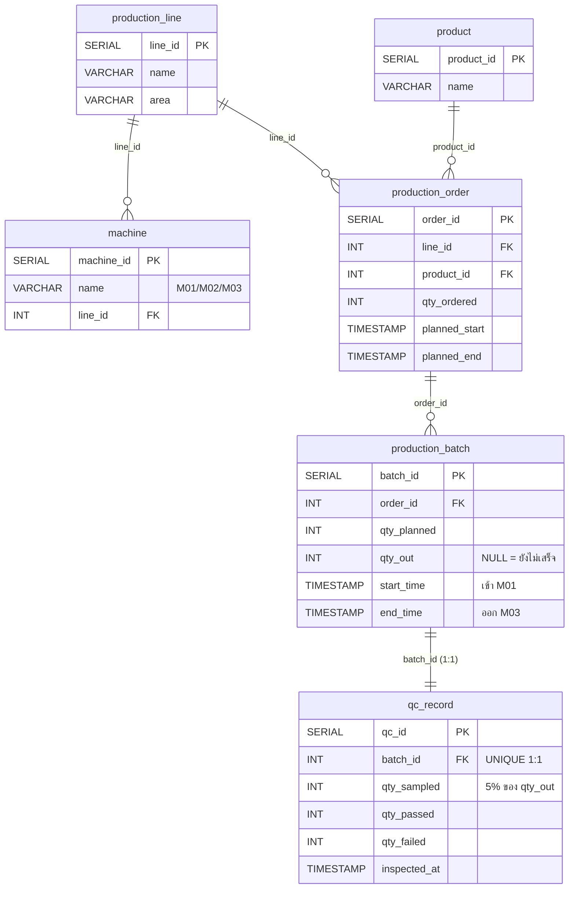
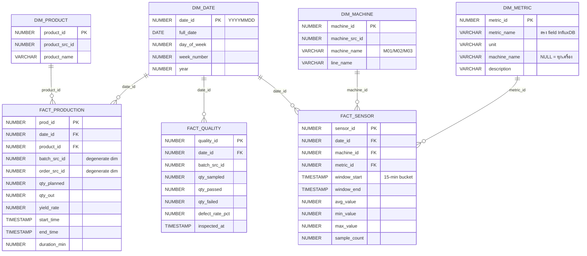

# ปัญหา ข้อกำหนดทางธุรกิจ และ ER-Diagram (อัปเดตตาม NEW_ARCHITECTURE)

> Version 2 — simplified เพื่อ POC process performance ของ 1 line
> (3 เครื่อง M01/M02/M03) ตาม NEW_ARCHITECTURE.md
>
> เอกสารเก่าที่ใหญ่เกิน (17 OLTP + 5 FACT + OEE + material) ถูก deprecate
> หลังทีมตัดสินใจลด scope

---

## 1. บริบท

โรงงานผลิตแบตเตอรี่ลูกค้า (SI scenario) ต้องการวัดผล process ของสายประกอบ
แบตเตอรี่ 1 line มี 3 เครื่อง — เริ่มจาก POC เพื่อขยายไป process อื่น

**Actors:**
- Process Engineer — สั่งจำนวน battery ที่จะผลิต + setup IIoT
- QC — นำ finished good มาตรวจ (สุ่ม 5% ต่อ batch)
- General Manager — ดู dashboard ทุก 15 นาที

**Data sources:**
- IIoT (NodeRED → InfluxDB 2.0 บน AWS) — sensor 1 Hz
- ERP (Supabase PostgreSQL) — production order, batch, qc

---

## 2. ปัญหา

| # | ปัญหา | ผลกระทบ |
|---|---|---|
| P1 | GM ไม่เห็นสถานะ line แบบ near-real-time | ตัดสินใจ reactive ช้า |
| P2 | IIoT sensor data อยู่คนละที่กับ batch/QC ข้อมูล | query ข้าม domain ไม่ได้ |
| P3 | ไม่มี data lineage (แก้บัคยาก) | stakeholder ไม่เชื่อตัวเลข |
| P4 | OLTP ถูก query ตรงจะกระทบ performance | ต้องแยก DW |

---

## 3. Business Requirements

### 3.1 Functional (FR)

| ID | Requirement | แก้ปัญหา |
|---|---|---|
| FR-1 | Dashboard refresh ทุก 15 นาที | P1 |
| FR-2 | แสดง production ของ 3 เครื่องแยก + overall ราย 15 นาที | P1, P2 |
| FR-3 | แสดง defect rate (QC 5% sampling) | P1 |
| FR-4 | แสดง sensor parameter ต่อ batch ราย 15 นาที | P2 |
| FR-5 | แสดง machine status (running/fault) จาก sensor | P1, P2 |
| FR-6 | ทุก STG row มี `src_system` + `pipeline_run_id` + `loaded_at` | P3 |

### 3.2 Non-Functional

| ID | Requirement | เกณฑ์ |
|---|---|---|
| NFR-1 | ETL idempotent | re-run window เดียวกันไม่เกิด duplicate |
| NFR-2 | Query dashboard < 2 วินาที | ทุก 15-min refresh |
| NFR-3 | Oracle 10g compatibility | ห้ามใช้ `IDENTITY` — ใช้ SEQUENCE |
| NFR-4 | ETL ไม่ write Supabase | read-only |

### 3.3 สูตร KPI

```
Yield Rate     = qty_out / qty_planned
Defect Rate %  = qty_failed / qty_sampled * 100
Machine Status = 1 (RUNNING) if avg(machine_state_num) >= 0.5 else 0 (FAULT)
Duration (min) = (end_time - start_time) in minutes
```

---

## 4. Mapping Requirement → Entity

| Req | OLTP (Supabase) | DW (Oracle AI03) |
|---|---|---|
| FR-1 refresh 15 min | — (DAG schedule `*/15 * * * *`) | FACT_* merge-by-key |
| FR-2 production 15 min | `production_batch` | `FACT_PRODUCTION` + `FACT_SENSOR` (machine_state) |
| FR-3 defect | `qc_record` | `FACT_QUALITY` |
| FR-4 sensor/batch | — (InfluxDB) | `FACT_SENSOR` + JOIN กับ `FACT_PRODUCTION` by time |
| FR-5 machine status | — | `FACT_SENSOR` where metric=machine_state_num |
| FR-6 lineage | — | STG `src_system`, `pipeline_run_id`, `loaded_at` |

---

## 5. OLTP ER-Diagram (Supabase — 6 ตาราง)



### จุดสำคัญ

- **ไม่มี stage_id** ใน production_batch → 1 batch = run ทั้ง line
- **machine.name** ต้องตรงกับ tag `machine_id` ใน InfluxDB (M01/M02/M03)
- **QC 1:1 batch** — ตรวจที่ end of line ไม่ตรวจรายช่วง

---

## 6. DW ER-Diagram (Oracle AI03 — 4 DIM + 3 FACT + 3 STG)

### 6.1 Star schema (Kimball)



### 6.2 Staging tables (ไม่มี FK — buffer เท่านั้น)

| Table | Source | Grain |
|---|---|---|
| `STG_PRODUCTION_BATCH` | Supabase `production_batch` (end_time IS NOT NULL) | 1 batch |
| `STG_QC_RECORD` | Supabase `qc_record` | 1 qc record |
| `STG_SENSOR_AGG` | InfluxDB 15-min aggregate | 1 row ต่อ (machine × metric × window) |

ทุก row มี: `src_system`, `pipeline_run_id`, `loaded_at`

### 6.3 จุดออกแบบ

- **DIM_METRIC เป็น master seed** ใน `01_schema.sql` (6 rows สำหรับ 6 sensor fields)
  เพิ่ม sensor ใหม่ = INSERT row ไม่แตะ schema
- **Sequence ไม่ใช่ IDENTITY** (Oracle 10g ไม่รองรับ)
- **degenerate dimensions:** `batch_src_id`, `order_src_id` ไม่มี DIM_* ของตัวเอง — เก็บ business key ไว้ใน FACT โดยตรง
- **FACT_SENSOR JOIN FACT_PRODUCTION by time window** → ใช้ใน query "sensor parameter per batch"

---

## 7. Cross-System Mapping (OLTP → STG → FACT)

### 7.1 Transactional

| OLTP (Supabase) | STG (Oracle) | FACT | SP |
|---|---|---|---|
| `production_batch` (end_time IS NOT NULL) | `STG_PRODUCTION_BATCH` | `FACT_PRODUCTION` | `SP_LOAD_FACT_PRODUCTION` |
| `qc_record` | `STG_QC_RECORD` | `FACT_QUALITY` | `SP_LOAD_FACT_QUALITY` |

### 7.2 Master data (one-shot)

| Source | Target | วิธี |
|---|---|---|
| Supabase `machine` + `production_line` | `DIM_MACHINE` | `sync_dimensions_from_supabase.py` |
| Supabase `product` | `DIM_PRODUCT` | `sync_dimensions_from_supabase.py` |
| NodeRED flow (hardcoded 6 metrics) | `DIM_METRIC` | seed ใน `01_schema.sql` |
| Oracle SYSDATE range | `DIM_DATE` | `SP_LOAD_DIM_DATE(start, days)` |

### 7.3 IIoT sensor (15-min aggregate)

| InfluxDB | STG | FACT | SP |
|---|---|---|---|
| `bucket=iiot_data_raw, measurement=station_1` (tag machine_id, fields 6 ตัว) | `STG_SENSOR_AGG` (machine × metric × window) | `FACT_SENSOR` (lookup DIM_MACHINE + DIM_METRIC) | `SP_LOAD_FACT_SENSOR` |

---

## 8. Execution Flow

```
      ┌──────────────┐        ┌────────────┐
      │   Supabase   │        │  InfluxDB  │
      │ 6 OLTP tables│        │ 15-min data│
      └──────┬───────┘        └─────┬──────┘
             │                      │
             │ etl_supabase*        │ etl_influx*
             │ (*/15 min)           │ (*/15 min)
             ▼                      ▼
      ┌─────────────────────────────────┐
      │ Oracle STG  (3 tables)          │
      │  STG_PRODUCTION_BATCH           │
      │  STG_QC_RECORD                  │
      │  STG_SENSOR_AGG                 │
      └──────────┬──────────────────────┘
                 │ sp_load_dw
                 │ (5 min offset)
                 ▼
      ┌─────────────────────────────────┐
      │ Oracle DW  (4 DIM + 3 FACT)     │
      │  merge-by-key (idempotent)      │
      └──────────┬──────────────────────┘
                 │ FastAPI /api/* endpoints
                 ▼
      ┌─────────────────────────────────┐
      │ Streamlit dashboard (4 tabs)    │
      │  Production / Quality /         │
      │  Sensor per batch /             │
      │  Machine status 15-min          │
      └─────────────────────────────────┘
```

---

## 9. ไฟล์อ้างอิง

| Path | คำอธิบาย |
|---|---|
| [db_module/db_sources/supabases_sql_query/query/01_schema.sql](../db_module/db_sources/supabases_sql_query/query/01_schema.sql) | OLTP 6 ตาราง |
| [db_module/db_sources/supabases_sql_query/query/02_master_data.sql](../db_module/db_sources/supabases_sql_query/query/02_master_data.sql) | Master seed (1 line + 3 machines + 3 products) |
| [db_module/db_sources/supabases_sql_query/mock/generate_mock_data.py](../db_module/db_sources/supabases_sql_query/mock/generate_mock_data.py) | Mock generator (Influx-aligned window) |
| [db_module/db_sources/oracle_sql_query/query/01_schema.sql](../db_module/db_sources/oracle_sql_query/query/01_schema.sql) | DW DDL (3 STG + 4 DIM + 3 FACT + DIM_METRIC seed) |
| [db_module/db_sources/oracle_sql_query/query/02_procedure_dim_date.sql](../db_module/db_sources/oracle_sql_query/query/02_procedure_dim_date.sql) | `SP_LOAD_DIM_DATE` |
| [db_module/db_sources/oracle_sql_query/query/03_procedure_fact_loaders.sql](../db_module/db_sources/oracle_sql_query/query/03_procedure_fact_loaders.sql) | 3 fact loader SPs (merge-by-key) |
| [db_module/db_sources/oracle_sql_query/query/04_reporting_queries.sql](../db_module/db_sources/oracle_sql_query/query/04_reporting_queries.sql) | Reporting SQL สำหรับ ad-hoc |
| [db_module/db_sources/oracle_sql_query/query/05_truncate_and_reload.sql](../db_module/db_sources/oracle_sql_query/query/05_truncate_and_reload.sql) | Full rebuild script |
| [db_module/db_sources/oracle_sql_query/run_sql_file.py](../db_module/db_sources/oracle_sql_query/run_sql_file.py) | รัน SQL ไฟล์ต่อ Oracle |
| [db_module/db_sources/oracle_sql_query/sync_dimensions_from_supabase.py](../db_module/db_sources/oracle_sql_query/sync_dimensions_from_supabase.py) | Seed DIM_MACHINE + DIM_PRODUCT |
| [db_module/db_sources/oracle_sql_query/verify_warehouse_schema.py](../db_module/db_sources/oracle_sql_query/verify_warehouse_schema.py) | ตรวจสอบ DW objects |
| [db_module/pipeline/airflow/dags/etl_supabase_to_oracle.py](../db_module/pipeline/airflow/dags/etl_supabase_to_oracle.py) | 2 extract tasks (batch + qc), 15-min |
| [db_module/pipeline/airflow/dags/etl_influxdb_to_oracle.py](../db_module/pipeline/airflow/dags/etl_influxdb_to_oracle.py) | Sensor aggregate, 15-min |
| [db_module/pipeline/airflow/dags/sp_load_dw.py](../db_module/pipeline/airflow/dags/sp_load_dw.py) | Chain 3 SPs, 5-min offset |
| [app/api/main.py](../app/api/main.py) | FastAPI operational + 8 dashboard endpoints |
| [app/streamlit/dashboard.py](../app/streamlit/dashboard.py) | 4-tab dashboard |
| [claude_track/NEW_PLAN.md](NEW_PLAN.md) | Migration plan (10 phases) |
